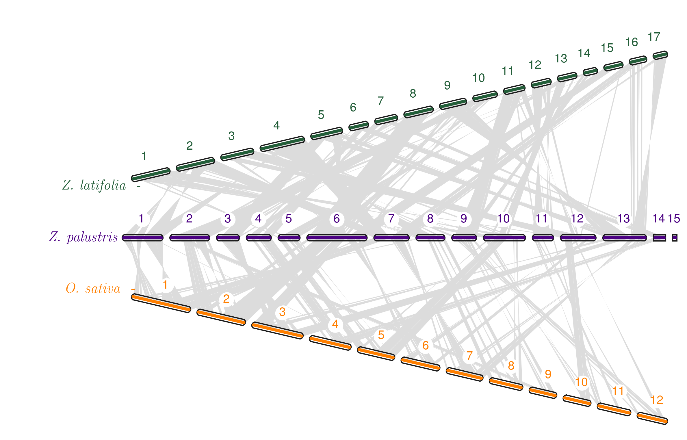
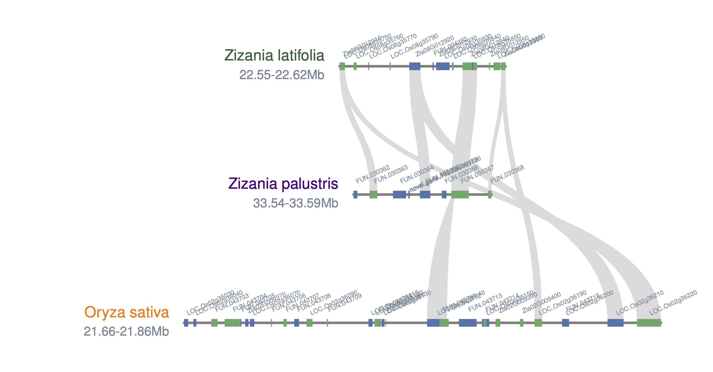

# Synteny plot (comparative genomics) tutorial
This tutorial is meant for members of the [Kimball Lab](https://wildricebreedingandgenetics.umn.edu/) at the University of Minnesota (Northern Wild Rice Conservation and Breeding) to understand how I made synteny plots using MCscan. The original tutorial by the author (Haibao Tang) can be found [here](https://github.com/tanghaibao/jcvi/wiki/MCscan-%28Python-version%29). This is an excellent resource (and is where I learned how to use the program). The tutorial given here is more focused on the needs of our program.

## Directory
1. [_Zizania palustris_ vs. _Oryza sativa_](#Zizania-palustris-vs-Oryza-sativa)
2. [_Zizania palustris_ vs. _Zizania latifolia_ (2015 version)](#Zizania-palustris-vs-Zizania-latifolia-2015-version)
3. [_Zizania palustris_ vs. _Zizania latifolia_ (2022 version)](#Zizania-palustris-vs-Zizania-latifolia-2022-version)
4. [Three species comparison](#Three-species-comparison)
5. [Coloring specific links](#Coloring-specific-links)
6. [Microsynteny](#Microsynteny)
7. [Claudia microsynteny](#Claudia-microsynteny)

## _Zizania palustris_ vs _Oryza sativa_

Depending on when you return to this tutorial, you may find that a script no longer works. When I came back to these scripts in January 2022 to put this tutorial together, the scripts (which previously worked) failed. The problem was that the system could not find the module files. The reason was that `module load python` was too generic. The default version became python 3.8 and I had installed the software under version 3.7. I fixed it by specifying `module load python3/3.7.4_anaconda2019.10` in the script. Once I did that, I had no issues whatsoever.

There are three lines in the script that use `sed`. They are there to remove superfluous trailing strings in the `bed` and `cds` files that cause identical gene names to not be recognized as identical.
```bash
sed -i  's/\.MSUv7.0//g' oryza.bed
sed -i  's/\..*$//g' oryza.cds
sed -i 's/\-.*$//g' wild_rice.cds
```

The last line of the script called [run_jcvi.sh](run_jcvi.sh) is what ultimately generates the figure. Note that [`seqids`](helper_files/seqids) and [`layout`](helper_files/layout) refer to files that provide vital information for how the figure appears.
```bash
python -m jcvi.graphics.karyotype seqids layout --format png
```
Here are some details about the [`layout`](helper_files/layout) file specifications:
-  `#4b0082` is for _Zizania palustris_
-  `#ff7f00` is for _Oryza sativa_

**Note:** As of this writing (14 January 2022), GitHub does not support colorizing text using HTML or other various methods that I found to insert color. The method that finally worked was to use [placeholder.com](https://placeholder.com). If previews of the color are unavaible, I apologize for that but the reason is likely a broken link. It's a minor thing, but feel free to report it to me if you encounter that issue.

When you're done, the finished figure should look like this:<br>


## _Zizania palustris_ vs _Zizania latifolia_ (2015 version)
This figure was made using the 2015 version of the _Z. latifolia_ genome. You can find that paper [here](https://onlinelibrary.wiley.com/doi/full/10.1111/tpj.12912) or using the following citation:<br><br>
**Guo L., Qiu J., Han Z., Ye Z., Chen C., Liu C., Xin X., _et al._** (2015) A host plant genome (_Zizania latifolia_) after a century-long endophyte infection. _Plant J._ **83**, 600-609

Pay special attention to the seqids file because it is different than the one used in the comparison with _O. sativa_ owing the the fact that _Z. latifolia_ genome has a different number of chromosomes than _O. sativa_ and the first version of the _Z. latifolia_ genome is more fragmented than the _Z. palustris_ genome. That is, there are more scaffolds than chromosomes/pseudochromosomes. Look at the [seqids_latifolia](helper_files/seqids_latifolia) file to see what I mean. This is why there are two tracks for _Z. latifolia_: one above the _Z. palustris_ track and the other below it. **Note:** When I ran this in my MSI account, the file was just called `seqids` but I renamed it here to avoid a file duplication conflict with the version used in the comparison with _O. sativa_. The same principle is true for the [layout_latifolia](helper_files/layout_latifolia) file.

Colors are specified in the `layout` file. We chose our color scheme after seeking consensus within the group on colors we liked and to be internally consistent. That means we use the same color for the same species across multiple figures within the same paper.<br>
-  `#235e39` is for _Zizania latifolia_
-  `#4b0082` is for _Zizania palustris_

When you're done, the finished figure should look like this:<br>


## _Zizania palustris_ vs _Zizania latifolia_ (2022 version)
The data were downloaded from [here](https://download.cncb.ac.cn/gwh/Plants/Zizania_latifolia_Zlat_genome_v1_GWHBFHI00000000/) using the following commands:
```bash
wget https://download.cncb.ac.cn/gwh/Plants/Zizania_latifolia_Zlat_genome_v1_GWHBFHI00000000/GWHBFHI00000000.gff.gz --no-check-certificate
```
**Note:** The `--no-check-certificate` was added because the MSI system prompted me to add it.


After retrieving the necessary data, I converted (renamed) the `GFF` file to `GFF3` format. This is because I was having problems with the next steps (finding anchors) and thought this had something to do with it. The problem, I thought, was that the proper gene names (beginning with "Zla") were not being inserted into the `BED` file; instead, the gene names all began with "gene_" followed by some number. Ultimately, this did **not** resolve my issue, but since it fixed the problem of bizarre gene names being inserted into the `BED` file, I decided to leave it.
```bash
mv GWHBFHI00000000.gff.gz GWHBFHI00000000.gff3.gz
```

The next step is to convert the `GFF` file to `BAM` format:
```bash
python -m jcvi.formats.gff bed GWHBFHI00000000.gff.gz -o latifolia_version_2.bed
```

Next:
```bash
python -m jcvi.formats.fasta format GWHBFHI00000000.CDS.fasta.gz latifolia_version_2.cds
```

The major roadblock in completing the analysis was that the primary gene names in the `.cds` file did not match up with the "Zla" gene names in the `.bed` file (or the "gene_" names for that matter). The "Zla" names were included further along in the `.cds` file headers so all that was needed to grab them was to remove a bunch of the extraneous information in the header of each gene. Once all of that was removed, the "Zla" gene names would be recognized as the primary gene name. In order to fix the `.cds` file, you will need to use the following sed one-liner:
```bash
sed -i 's/^.*OriGeneID=/>/g' latifolia_version_2.cds
```

Before making the karyotype figure, we need to change (simplify) the chromosome names in the _Z. latifolia_ `.bed` file:
```bash
sed -i 's/GWHBFHI00000001/Chr1/g' latifolia_version_2.bed
```


**Note:** Regarding the order of the _Zizania latifolia_ chromsome order: the authors assigned chromosome numbers based on size in decreasing order. This explains why our chromosome numbers do not match up despite the close evolutionary relationship of _Zizania latifolia_ and _Zizania palustris_. We assigned our chromosome numbers based on their synteny with _Oryza sativa_. At the time of our publication, the updated _Zizania latifolia_ genome was not available.

## Three species comparison
If we wanted to make another plot showing synteny between all three species (_Zizania palustris_, _Zizania latifolia_, and _Oryza sativa_), we only need to modify small aspects of the code we've already run. The `.bed` and `.cds` files already exist. The `layout` and `seqids` files only need slight modifications. To keep things clean, I created a new subdirectory to work in: `/home/jkimball/haasx092/other_synteny_figures/three_species_plot` and copied all of the relevant `.bed` and `.cds` files to this directory. I also copied the existing `layout` and `seqids` files to this directory before modifying them. The basic `layout` file looks like this:
```bash
#y, xstart, xend, rotation, color, label, va, bed, label_va
0.8, 0.18, 0.98, 0, #235e39, \it Z. latifolia \space -, top, latifolia_version_2.bed, center
0.6, 0.18, 0.98, 0, #4b0082, \it Z. palustris \space -, top, wild_rice.bed, center
0.4, 0.18, 0.98, 0, #ff7f00, \it O. sativa \space -, top, oryza.bed, center
# edges
e, 0, 1, wild_rice.latifolia_version_2.anchors.simple
e, 1, 2, wild_rice.oryza.anchors.simple
```
**Note:** The syntax for the labels are a little weird (for lack of a better word in my opinion). The `\it` aspect is LaTeX syntax for converting the text that follows it to italics (which is necessary for a Latin binomial) and the `\space` LaTeX syntax represents an attempt to add space after the species name because the text was running into the graphical representation of the first chromosome for each species. I'm not convinced that it was actually doing anything because even when I added 5 of these, I still had this problem. Other LaTeX solutions for adding spaces resulted in errors, but this completed without error so I left it in. Anyway, I think it was the inclusion of the hyphen (`-`) that actually soved my issue. It's also not really visible in the final figure unless you choose to rotate the position of the chromosomes. This is also why the genus names are not completely spelled out-to shorten the length of the name to avoid having it run into the graphical representation of the chromosomes. I did not previously have this issue, so I don't know why I am having it now-but I am. I also tried to play around with the `xstart` position, but that just resulted in the label running off the left side of the page. You might also notice that the `y` positions denote where along the y-axis each track is drawn (e.g., 0.4, 0.6, and 0.8). This is why there will be superfluous white space at the bottom of each figure. I would recommend cropping that white space out using any editor of your choice. Especially if you want to put the final figure into a paper where it won't be visible, except that it could affect formatting in a multi-panel figure or if it would need to be shrunk to avoid overlapping with text.

Now for the `seqids` file:
```bash
Chr1,Chr2,Chr3,Chr4,Chr5,Chr6,Chr7,Chr8,Chr9,Chr10,Chr11,Chr12,Chr13,Chr14,Chr15,Chr16,Chr17
Chr1,Chr2,Chr3,Chr4,Chr5,Chr6,Chr7,Chr8,Chr9,Chr10,Chr11,Chr12,Chr13,Chr14,Chr15
Chr1,Chr2,Chr3,Chr4,Chr5,Chr6,Chr7,Chr8,Chr9,Chr10,Chr11,Chr12
```
All this file really does is specify the chromosome labels for each species. The top line (track 0) represents _Zizania latifolia_, the middle line (track 1) represents _Zizania palustris_, and the third line (track 2) represents _Oryza sativa_. They can be in whichever order you like, but the `layout` and `seqids` files need to agree with each other.

**Note:** Since we are reusing exising files (because why reinvent the wheel?), you might forget that you need to load the required programs. So, remember to load all of the necessary programs before you try to run any code :smiley:<br>
```bash
export PATH=$PATH:/home/jkimball/haasx092/synteny_figure/last-1060/src
export PATH=$PATH:/home/jkimball/haasx092/synteny_figure/install-tl-20200505/1/bin/x86_64-linux

module load python
```
Then, all you need to run is:<br>
```bash
python -m jcvi.graphics.karyotype seqids layout --format png
```
This "default" figure will  look like this:<br>


You can rotate whichever chromosome track you like by altering the the "rotation" parameter in the `layout` file:<br>
```bash
#y, xstart, xend, rotation, color, label, va, bed, label_va
0.8, 0.18, 0.98, 15, #235e39, \it Z. latifolia \space -, top, latifolia_version_2.bed, center
0.6, 0.18, 0.98, 0, #4b0082, \it Z. palustris \space -, top, wild_rice.bed, center
0.4, 0.18, 0.98, -15, #ff7f00, \it O. sativa \space -, top, oryza.bed, center
# edges
e, 0, 1, wild_rice.latifolia_version_2.anchors.simple
e, 1, 2, wild_rice.oryza.anchors.simple
```
After modifying the `layout` file, run the same one line of code as you did before:<br>
```bash
python -m jcvi.graphics.karyotype seqids layout --format png
```

Results in:<br>


If you would rather have straight lines showing connections between syntenic regions (rather than Bezier curves), simply add `--shadestyle=line` to the code that creates the figure.
```bash
python -m jcvi.graphics.karyotype seqids layout --format png --shadestyle=line
```
Results in:<br>


## Coloring specific links
At some point, you may want to add color between links to draw your audience's attention to one or a few specific links. You can do this by making small edits to the `.simple` file(s). Also just for the record, the default grey is called "gainsboro" in the python named color universe. (I didn't know where else to mention this or if anyone would care, but I found it while investigating how the `karyotype.py` script works, so I thought I would mention it.

You add color by adding `r*` before the genes that you want to highlight. Below is a _sample excerpt_ from a `.simple` file. I am not including a full `.simple` file in this `README` document because it would take up unnecessary space and I think this gets the point across. The "r" will make it red. If you want, you can pick other colors like blue (b), green (g), cyan (c), magenta (m), yellow (y), black (k), or white (w). You can also specify any color you want using its HEX code. More on that below.
```bash
FUN_001229      FUN_001281      LOC_Os09g27940  LOC_Os09g28560  52      -
FUN_001289      FUN_001454      LOC_Os09g24540  LOC_Os09g27590  205     -
FUN_001457      FUN_001632      LOC_Os09g36140  LOC_Os09g39870  247     -
FUN_001647      FUN_001719      LOC_Os09g33510  LOC_Os09g36040  103     -
FUN_002470      FUN_002503      r*LOC_Os01g39890  LOC_Os01g40700  48      -
FUN_002506      FUN_002599      r*LOC_Os01g36070        LOC_Os01g39630  146     -
FUN_002675      FUN_002796      r*LOC_Os01g16090        LOC_Os01g19970  173     +
FUN_002804      FUN_002841      r*LOC_Os01g20970        LOC_Os01g22954  66      +
FUN_002883      FUN_002979      r*LOC_Os01g13100        LOC_Os01g15290  130     +
FUN_002984      FUN_003152      r*LOC_Os01g09890        LOC_Os01g13040  212     +
FUN_003189      FUN_003284      r*LOC_Os01g07810        LOC_Os01g09770  127     +
FUN_003318      FUN_003365      r*LOC_Os01g05430        LOC_Os01g06640  71      -
FUN_003391      FUN_003453      r*LOC_Os01g01890        LOC_Os01g03980  103     +
FUN_003488      FUN_003588      LOC_Os08g01054  LOC_Os08g02860  127     +
FUN_003593      FUN_003761      LOC_Os08g03240  LOC_Os08g06640  213     +
FUN_003768      FUN_003798      LOC_Os08g07400  LOC_Os08g08210  46      +
```

Using the complete version of the above `.simple` file will result in the following figure:<br>


Using HEX codes, the `.simple` file would look something like this:
```bash
FUN_014647      FUN_014795      LOC_Os05g50490  LOC_Os05g51860  132     -
FUN_014851      FUN_014891      LOC_Os05g49580  LOC_Os05g50130  47      -
FUN_015145      FUN_015178      LOC_Os02g42406  LOC_Os02g42850  34      -
#235e39*FUN_015215      FUN_015367      LOC_Os01g39770  LOC_Os01g42820  195     -
#235e39*FUN_015373      FUN_015488      LOC_Os01g36580  LOC_Os01g39380  146     -
#235e39*FUN_015503      FUN_015653      LOC_Os01g31110  LOC_Os01g35230  196     -
#235e39*FUN_015708      FUN_015846      LOC_Os01g18420  LOC_Os01g21440  158     +
#235e39*FUN_015892      FUN_016018      LOC_Os01g22336  LOC_Os01g25600  162     +
#235e39*FUN_016056      FUN_016149      LOC_Os01g15470  LOC_Os01g16230  75      +
#235e39*FUN_016190      FUN_016243      LOC_Os01g14310  LOC_Os01g14870  50      -
#235e39*FUN_016235      FUN_016350      LOC_Os01g16240  LOC_Os01g18100  109     -
#235e39*FUN_016439      FUN_016539      LOC_Os01g09590  LOC_Os01g10520  92      +
#235e39*FUN_016564      FUN_016713      LOC_Os01g10680  LOC_Os01g12690  162     +
#235e39*FUN_016715      FUN_016919      LOC_Os01g07080  LOC_Os01g08860  181     -
#235e39*FUN_016923      FUN_017105      LOC_Os01g02860  LOC_Os01g06836  243     -
#235e39*FUN_017109      FUN_017164      LOC_Os01g01010  LOC_Os01g02200  76      -
#235e39*FUN_017179      FUN_018308      LOC_Os01g58080  LOC_Os01g74570  1230    -
#235e39*FUN_018309      FUN_019085      LOC_Os01g45140  LOC_Os01g57940  894     -
#235e39*FUN_019090      FUN_019163      LOC_Os01g42840  LOC_Os01g44360  95      -
FUN_019632      FUN_019675      LOC_Os04g08060  LOC_Os04g09260  50      -
FUN_019707      FUN_019766      LOC_Os04g01070  LOC_Os04g03100  88      - 
```
**Note:** I used `#235e39` because I think it is a particularly pretty shade of green. `#235e39` = 

You can also choose to use any legal HTML color that you like (e.g., "burlywood" or "chartreuse").

In addition to color, you can choose various shades of grey by specifying a number between 0 and 1 (e.g., 0.5 as in the example below).
```bash
FUN_014647      FUN_014795      LOC_Os05g50490  LOC_Os05g51860  132     -
FUN_014851      FUN_014891      LOC_Os05g49580  LOC_Os05g50130  47      -
FUN_015145      FUN_015178      LOC_Os02g42406  LOC_Os02g42850  34      -
0.5*FUN_015215      FUN_015367      LOC_Os01g39770  LOC_Os01g42820  195     -
0.5*FUN_015373      FUN_015488      LOC_Os01g36580  LOC_Os01g39380  146     -
0.5*FUN_015503      FUN_015653      LOC_Os01g31110  LOC_Os01g35230  196     -
0.5*FUN_015708      FUN_015846      LOC_Os01g18420  LOC_Os01g21440  158     +
0.5*FUN_015892      FUN_016018      LOC_Os01g22336  LOC_Os01g25600  162     +
0.5*FUN_016056      FUN_016149      LOC_Os01g15470  LOC_Os01g16230  75      +
0.5*FUN_016190      FUN_016243      LOC_Os01g14310  LOC_Os01g14870  50      -
0.5*FUN_016235      FUN_016350      LOC_Os01g16240  LOC_Os01g18100  109     -
0.5*FUN_016439      FUN_016539      LOC_Os01g09590  LOC_Os01g10520  92      +
0.5*FUN_016564      FUN_016713      LOC_Os01g10680  LOC_Os01g12690  162     +
0.5*FUN_016715      FUN_016919      LOC_Os01g07080  LOC_Os01g08860  181     -
0.5*FUN_016923      FUN_017105      LOC_Os01g02860  LOC_Os01g06836  243     -
0.5*FUN_017109      FUN_017164      LOC_Os01g01010  LOC_Os01g02200  76      -
0.5*FUN_017179      FUN_018308      LOC_Os01g58080  LOC_Os01g74570  1230    -
0.5*FUN_018309      FUN_019085      LOC_Os01g45140  LOC_Os01g57940  894     -
0.5*FUN_019090      FUN_019163      LOC_Os01g42840  LOC_Os01g44360  95      -
FUN_019632      FUN_019675      LOC_Os04g08060  LOC_Os04g09260  50      -
FUN_019707      FUN_019766      LOC_Os04g01070  LOC_Os04g03100  88      - 
```


**A note regarding using RGB (red, green, blue) color notation:**<br>Another way of specifying colors is with the RGB format or RGBA format where a=alpha, a value indicating how transparent a color should be where 0=fully transparent and 1=fully opaque). In RGB/RGBA format, each value needs to be a float value between 0 and 1 so if you have integers (such as 35,94,57 that matches HEX code #235e39 above) you could convert them to floats by dividing each value by 255. I do not think it is possible to specify a specific color in this particular way. I tried every variation of syntax that I thought would work, but every single one of them resulted in a traceback error. I did some digging through source code and I think I understand why RGB notation cannot be used. The code for MCscan is written in python and as such the colors are ultimately derived from [matplotlib](https://matplotlib.org/). The links are drawn using code contained within the `synteny.py` script from MCscan. In that script, an object of class Shade() is defined. There are several optional parameters including two relevant parameters called edge color (ec) and face color (fc) with the default set to black (k). In the `karyotype.py` script, the default value for both ec and fc parameters is changed to "gainsboro" which explains why the default links are grey and not black.

I think the thing that is key here is that the parameters expect strings as input. This is why single-color codes, HEX codes, named colors, and even float values (if you desire greyscale) all work: they can all be interpreted as string values. Even though the greyscale values are technically floats, they can be interpreted as strings before being converted to floats. The RGB notation would be interpreted as a tuple. With this in mind, there is probably a solution to enable the usage of RGB values involving editing the `synteny.py` source code, but it's probably just easier to translate your RGB values to a HEX code using the internet. 🌐

## Microsynteny
In some cases, you may want to look at a specific region more closely, such as the one surrounding the _shattering4_ (_sh4_) gene.

## Claudia microsynteny

After the first attempt at generating this figure, the image looks like this:<br>


**Note:** The output of the MCscan code is a PDF file. Before uploading it here, I first converted it to PNG format (as I do for all of my GitHub images), but I also cropped out excess whitespace because there is often excess whitespace around MCscan figures (especially the karyotype figures like this one). Also for this reason, some of the example figures shown below might look like they are different sizes. This is because when I cropped out the excess white space, I didn't pay super close attention to ensuring that I cropped out exactly the same amount of white space each time. I figured it isn't really necessary for purposes of this tutorial (vs. preparing a figure for publication in a manuscript).

Filtering the `bed` file:

```bash
awk '$4~/^Zla08/' 3species_micro-collinearity.bed >> 3species_micro-collinearity_filtered.bed
awk '$1~/Chr6/ && $4~/^FUN/' 3species_micro-collinearity.bed 3species_micro-collinearity.bed >> 3species_micro-collinearity_filtered.bed
awk '$4~/^LOC_Os02/' 3species_micro-collinearity.bed >> 3species_micro-collinearity_filtered.bed
```
**Note:** I used the `>>` symbol so I could iteratively add (append) selections for each specific species/chromosome pair without overwriting the previous work, which would have happened if I used the `>` symbol (writes the "standard output" from a Unix command to a file). Here's the logic of the AWK code: Field 4 (`$4`) in the `bed` file contains the gene names and both the _Zizania latifolia_ and _Oryza sativa_ gene names indicate both species (e.g.,"Zla" or "LOC_Os") and chromosome number (e.g., "08" or "02"), so I was able to select on both factors simultaneously. Because the gene names for _Zizania palustris_ are the original gene names from the [FUNannotate pipeline](https://funannotate.readthedocs.io/en/latest/tutorials.html), they have the prefix "FUN" and so do not contain any reference to species _or_ chromosome number. This is why I also had to select the first field/column (`$1`) to select for the chromosome that we wanted.

There was another change that I had to make to improve upon the initial figure. In the initial figure, you'll notice that the links go from the _Zizania latifolia_ chromosome directly to that of _Oryza sativa_. There are no links from _Zizania palustris_ to _Oryza sativa_. That's because in the initial `blocks.layout` file, I the line `e, 0, 1` repeated twice under `#edges`. Changing the second line to `e, 1, 2` fixed this. Here is an excerpt from the MCscan tutorial:<br>
>Like the layout file in the macro-synteny section, edges stanza say connecting grape (column 0) with peach (column 1) and grape (column 0) with cacao (column 2).

That figure has one chromosome (grape) on top and two chromsomes (peach and cacao) next to each other on the . In any case, I think you should interpret the `blocks.layout` file shown below as "connect _Zizania latifolia_ to _Zizania palustris_ (e.g., 0,1) and connect _Zizania palustris_ to _Oryza sativa_ (e.g., 1,2)."

The top three lines (apart from the header line) indicate where the chromosome lines themselves are oriented. I think the x-axis value (0.6) for all ends up being the center of the chromosome while the y-axis values (0.8, 0.6, and 0.4) orient the chromosomes vertically. I set horizontal alignment ("ha") to be "left", but I think the lengths of some of the chromosomes (especially _Oryza sativa_) impact this in practice.

The `blocks.layout` file should look like this:<br>
```bash
# x, y, rotation, ha, va, color, ratio, label, chr
0.6, 0.8, 0, left, center, #235e39, 1, Zizania\ latifolia, chr08
0.6, 0.6, 0, left, center, #4b0082, 1, Zizania\ palustris,  chr06
0.6, 0.4, 0, left, center, #ff7f00, 1, Oryza\ sativa, chr02
# edges
e, 0, 1
e, 1, 2
```
(The species names are currently not in italics like I think they should be, but that's a problem for another day.)

Another thing that we might want to do is change the color of the genes to show homology between species. The default colors are blue and green which I think represent the strand that the gene is on. In order to change the color of the genes, we simply add `--glyphcolor=orthogroup` to the script so that it now looks like this:<br>
```bash
python -m jcvi.graphics.synteny claudia_blocks_ordered 3species_micro-collinearity_filtered.bed blocks.layout --genelabelsize=5 --glyphcolor=orthogroup
```

Now, the figure looks like this:<br>


Now that some of the bigger issues with the figure have been addressed, it is time to figure out how to italicize the species names (to fit with convention). Simplly adding `\it` in front of each species name (and removing the `\` after the genus names is enough to do achieve this.

The `blocks.layout` file should now look like this:<br>
```bash
# x, y, rotation, ha, va, color, ratio, label, chr
0.6, 0.8, 0, left, center, #235e39, 1, \it Zizania latifolia, chr08
0.6, 0.6, 0, left, center, #4b0082, 1, \it Zizania palustris,  chr06
0.6, 0.4, 0, left, center, #ff7f00, 1, \it Oryza sativa, chr02
# edges
e, 0, 1
e, 1, 2
```

Now, the figure looks like this:<br>


If you want to change the color of the species names to black, that's also very easy to do. The HEX codes usesd so far in the `blocks.layout` file were used to match the colors used to represent each species in the [genome paper](https://onlinelibrary.wiley.com/doi/full/10.1111/tpj.15419) for consistency.

The `blocks.layout` file will look like this:<br>
```bash
# x, y, rotation, ha, va, color, ratio, label, chr
0.6, 0.8, 0, left, center, black, 1, \it Zizania latifolia, chr08
0.6, 0.6, 0, left, center, black, 1, \it Zizania palustris,  chr06
0.6, 0.4, 0, left, center, black, 1, \it Oryza sativa, chr02
# edges
e, 0, 1
e, 1, 2
```

Now, the figure will look like this:<br>

