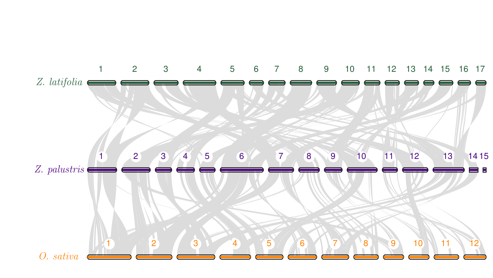

# Synteny plot (comparative genomics) tutorial
This tutorial is meant for members of the [Kimball Lab](https://wildricebreedingandgenetics.umn.edu/) at the University of Minnesota (Northern Wild Rice Conservation and Breeding) to understand how I made synteny plots using MCscan. The original tutorial by the author (Haibao Tang) can be found [here](https://github.com/tanghaibao/jcvi/wiki/MCscan-%28Python-version%29). This is an excellent resource (and is where I learned how to use the program). The tutorial given here is more focused on the needs of our program.

## Directory
1. [_Zizania palustris_ vs. _Oryza sativa_](#Zizania-palustris-vs-Oryza-sativa)
2. [_Zizania palustris_ vs. _Zizania latifolia_ (2015 version)](#Zizania-palustris-vs-Zizania-latifolia-2015-version)
3. [_Zizania palustris_ vs. _Zizania latifolia_ (2022 version)](#Zizania-palustris-vs-Zizania-latifolia-2022-version)
4. [Three species comparison](#Three-species-comparison)
5. [Microsynteny](#Microsynteny)

## _Zizania palustris_ vs _Oryza sativa_

Depending on when you return to this tutorial, you may find that a script no longer works. When I came back to these scripts in January 2022 to put this tutorial together, the scripts (which previously worked) failed. The problem was that the system could not find the module files. The reason was that `module load python` was too generic. The default version became python 3.8 and I had installed the software under version 3.7. I fixed it by specifying `module load python3/3.7.4_anaconda2019.10` in the script. Once I did that, I had no issues whatsoever.

There are three lines in the script that use `sed`. They are there to remove superfluous trailing strings in the `bed` and `cds` files that cause identical gene names to not be recognized as identical.
```bash
sed -i  's/\.MSUv7.0//g' oryza.bed
sed -i  's/\..*$//g' oryza.cds
sed -i 's/\-.*$//g' wild_rice.cds
```

The last line of the script called [run_jcvi.sh](run_jcvi.sh) is what ultimately generates the figure. Note that [`seqids`](helper_files/seqids) and [`layout`](helper_files/layout) refer to files that provide vital information for how the figure appears.
```bash
python -m jcvi.graphics.karyotype seqids layout --format png
```
Here are some details about the [`layout`](helper_files/layout) file specifications:
-  `#4b0082` is for _Zizania palustris_
-  `#ff7f00` is for _Oryza sativa_

**Note:** As of this writing (14 January 2022), GitHub does not support colorizing text using HTML or other various methods that I found to insert color. The method that finally worked was to use [placeholder.com](https://placeholder.com). If previews of the color are unavaible, I apologize for that but the reason is likely a broken link. It's a minor thing, but feel free to report it to me if you encounter that issue.

When you're done, the finished figure should look like this:<br>


## _Zizania palustris_ vs _Zizania latifolia_ (2015 version)
This figure was made using the 2015 version of the _Z. latifolia_ genome. You can find that paper [here](https://onlinelibrary.wiley.com/doi/full/10.1111/tpj.12912) or using the following citation:<br><br>
**Guo L., Qiu J., Han Z., Ye Z., Chen C., Liu C., Xin X., _et al._** (2015) A host plant genome (_Zizania latifolia_) after a century-long endophyte infection. _Plant J._ **83**, 600-609

Pay special attention to the seqids file because it is different than the one used in the comparison with _O. sativa_ owing the the fact that _Z. latifolia_ genome has a different number of chromosomes than _O. sativa_ and the first version of the _Z. latifolia_ genome is more fragmented than the _Z. palustris_ genome. That is, there are more scaffolds than chromosomes/pseudochromosomes. Look at the [seqids_latifolia](helper_files/seqids_latifolia) file to see what I mean. This is why there are two tracks for _Z. latifolia_: one above the _Z. palustris_ track and the other below it. **Note:** When I ran this in my MSI account, the file was just called `seqids` but I renamed it here to avoid a file duplication conflict with the version used in the comparison with _O. sativa_. The same principle is true for the [layout_latifolia](helper_files/layout_latifolia) file.

Colors are specified in the `layout` file. We chose our color scheme after seeking consensus within the group on colors we liked and to be internally consistent. That means we use the same color for the same species across multiple figures within the same paper.<br>
-  `#235e39` is for _Zizania latifolia_
-  `#4b0082` is for _Zizania palustris_

When you're done, the finished figure should look like this:<br>


## _Zizania palustris_ vs _Zizania latifolia_ (2022 version)
The data were downloaded from [here](https://download.cncb.ac.cn/gwh/Plants/Zizania_latifolia_Zlat_genome_v1_GWHBFHI00000000/) using the following commands:
```bash
wget https://download.cncb.ac.cn/gwh/Plants/Zizania_latifolia_Zlat_genome_v1_GWHBFHI00000000/GWHBFHI00000000.gff.gz --no-check-certificate
```
**Note:** The `--no-check-certificate` was added because the MSI system prompted me to add it.


After retrieving the necessary data, I converted (renamed) the `GFF` file to `GFF3` format. This is because I was having problems with the next steps (finding anchors) and thought this had something to do with it. The problem, I thought, was that the proper gene names (beginning with "Zla") were not being inserted into the `BED` file; instead, the gene names all began with "gene_" followed by some number. Ultimately, this did **not** resolve my issue, but since it fixed the problem of bizarre gene names being inserted into the `BED` file, I decided to leave it.
```bash
mv GWHBFHI00000000.gff.gz GWHBFHI00000000.gff3.gz
```

The next step is to convert the `GFF` file to `BAM` format:
```bash
python -m jcvi.formats.gff bed GWHBFHI00000000.gff.gz -o latifolia_version_2.bed
```

Next:
```bash
python -m jcvi.formats.fasta format GWHBFHI00000000.CDS.fasta.gz latifolia_version_2.cds
```

The major roadblock in completing the analysis was that the primary gene names in the `.cds` file did not match up with the "Zla" gene names in the `.bed` file (or the "gene_" names for that matter). The "Zla" names were included further along in the `.cds` file headers so all that was needed to grab them was to remove a bunch of the extraneous information in the header of each gene. Once all of that was removed, the "Zla" gene names would be recognized as the primary gene name. In order to fix the `.cds` file, you will need to use the following sed one-liner:
```bash
sed -i 's/^.*OriGeneID=/>/g' latifolia_version_2.cds
```

Before making the karyotype figure, we need to change (simplify) the chromosome names in the _Z. latifolia_ `.bed` file:
```bash
sed -i 's/GWHBFHI00000001/Chr1/g' latifolia_version_2.bed
```


## Three species comparison
If we wanted to make another plot showing synteny between all three species (_Zizania palustris_, _Zizania latifolia_, and _Oryza sativa_), we only need to modify small aspects of the code we've already run. The `.bed` and `.cds` files already exist. The `layout` and `seqids` files only need slight modifications. To keep things clean, I created a new subdirectory to work in: `/home/jkimball/haasx092/other_synteny_figures/three_species_plot` and copied all of the relevant `.bed` and `.cds` files to this directory. I also copied the existing `layout` and `seqids` files to this directory before modifying them. The basic `layout` file looks like this:
```bash
#y, xstart, xend, rotation, color, label, va, bed, label_va
0.8, 0.18, 0.98, 0, #235e39, \it Z. latifolia \space -, top, latifolia_version_2.bed, center
0.6, 0.18, 0.98, 0, #4b0082, \it Z. palustris \space -, top, wild_rice.bed, center
0.4, 0.18, 0.98, 0, #ff7f00, \it O. sativa \space -, top, oryza.bed, center
# edges
e, 0, 1, wild_rice.latifolia_version_2.anchors.simple
e, 1, 2, wild_rice.oryza.anchors.simple
```
**Note:** The syntax for the labels are a little weird (for lack of a better word in my opinion). The `\it` aspect is LaTeX syntax for converting the text that follows it to italics (which is necessary for a Latin binomial) and the `\space` LaTeX syntax represents an attempt to add space after the species name because the text was running into the graphical representation of the first chromosome for each species. I'm not convinced that it was actually doing anything because even when I added 5 of these, I still had this problem. Other LaTeX solutions for adding spaces resulted in errors, but this completed without error so I left it in. Anyway, I think it was the inclusion of the hyphen (`-`) that actually soved my issue. It's also not really visible in the final figure unless you choose to rotate the position of the chromosomes. This is also why the genus names are not completely spelled out-to shorten the length of the name to avoid having it run into the graphical representation of the chromosomes. I did not previously have this issue, so I don't know why I am having it now-but I am. I also tried to play around with the `xstart` position, but that just resulted in the label running off the left side of the page. You might also notice that the `y` positions denote where along the y-axis each track is drawn (e.g., 0.4, 0.6, and 0.8). This is why there will be superfluous white space at the bottom of each figure. I would recommend cropping that white space out using any editor of your choice. Especially if you want to put the final figure into a paper where it won't be visible, except that it could affect formatting in a multi-panel figure or if it would need to be shrunk to avoid overlapping with text.

Now for the `seqids` file:
```bash
Chr1,Chr2,Chr3,Chr4,Chr5,Chr6,Chr7,Chr8,Chr9,Chr10,Chr11,Chr12,Chr13,Chr14,Chr15,Chr16,Chr17
Chr1,Chr2,Chr3,Chr4,Chr5,Chr6,Chr7,Chr8,Chr9,Chr10,Chr11,Chr12,Chr13,Chr14,Chr15
Chr1,Chr2,Chr3,Chr4,Chr5,Chr6,Chr7,Chr8,Chr9,Chr10,Chr11,Chr12
```
All this file really does is specify the chromosome labels for each species. The top line (track 0) represents _Zizania latifolia_, the middle line (track 1) represents _Zizania palustris_, and the third line (track 2) represents _Oryza sativa_. They can be in whichever order you like, but the `layout` and `seqids` files need to agree with each other.

**Note:** Since we are reusing exising files (because why reinvent the wheel?), you might forget that you need to load the required programs. So, remember to load all of the necessary programs before you try to run any code :smiley:<br>
```bash
export PATH=$PATH:/home/jkimball/haasx092/synteny_figure/last-1060/src
export PATH=$PATH:/home/jkimball/haasx092/synteny_figure/install-tl-20200505/1/bin/x86_64-linux

module load python
```
Then, all you need to run is:<br>
```bash
python -m jcvi.graphics.karyotype seqids layout --format png
```
This "default" figure will  look like this:<br>


You can rotate whichever chromosome track you like by altering the the "rotation" parameter in the `layout` file:<br>
```bash
#y, xstart, xend, rotation, color, label, va, bed, label_va
0.8, 0.18, 0.98, 15, #235e39, \it Z. latifolia \space -, top, latifolia_version_2.bed, center
0.6, 0.18, 0.98, 0, #4b0082, \it Z. palustris \space -, top, wild_rice.bed, center
0.4, 0.18, 0.98, -15, #ff7f00, \it O. sativa \space -, top, oryza.bed, center
# edges
e, 0, 1, wild_rice.latifolia_version_2.anchors.simple
e, 1, 2, wild_rice.oryza.anchors.simple
```
After modifying the `layout` file, run the same one line of code as you did before:<br>
```bash
python -m jcvi.graphics.karyotype seqids layout --format png
```

Results in:<br>


If you would rather have straight lines showing connections between syntenic regions (rather than Bezier curves), simply add `--shadestyle=line` to the code that creates the figure.
```bash
python -m jcvi.graphics.karyotype seqids layout --format png --shadestyle=line
```
Results in:<br>


## Microsynteny
In some cases, you may want to look at a specific region more closely, such as the one surrounding the _shattering4_ (_sh4_) gene.
